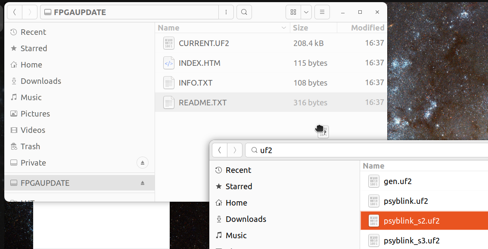
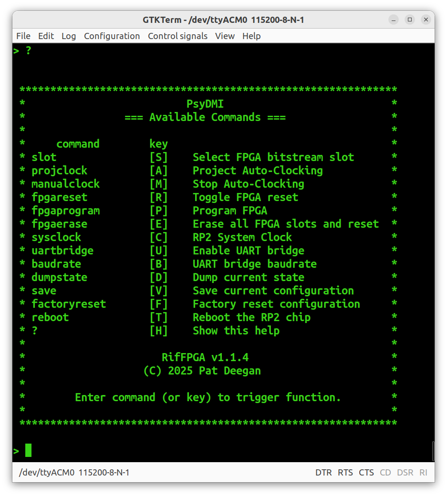
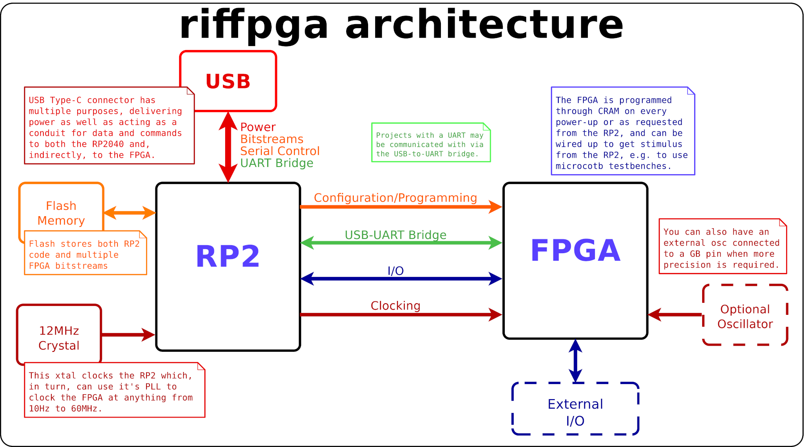
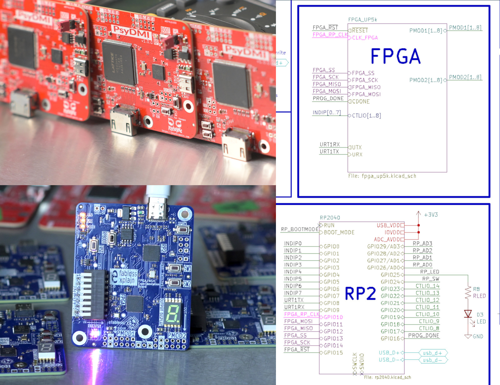

# riffpga
riffpga -- the easiest way to program and control your FPGA


Copyright &copy; 2024-2025 Pat Deegan, [psychogenic.com](https://psychogenic.com)

# Overview

With riffpga you get:

  *  **drag & drop** configuration of pretty much any FPGA: copy the file to the drive and programming is done;
  
  *  a dynamically **configurable clock** frequency for the FPGA designs: clock designs from 10Hz to (at least) 40MHz;
  
  *  **multiple bitstream** slots that can be switched on the fly: change the design that's running at any time without reprogramming;
  
  *  **named slots** for bitstreams and associated **clock frequency**, adjusted on the fly when loaded;
  
  *  a **serial interface** to manage clock rates, reset the FPGA, select bitstreams or do pretty much anything you'd like; and
  
  *  A **USB-to-UART** serial bridge to the FPGA.
  
  
And all this basically costs you a whole dollar.  At this time, the system's been tested with [Lattice iCE40 HX](https://www.latticesemi.com/ice40) and [UltaPlus](https://www.latticesemi.com/en/Products/FPGAandCPLD/iCE40UltraPlus) chips, but anything that has a *CRAM* mode we can manually twiddle to configure the FPGA should be doable.


## Drag & Drop Programming

Drag & drop, or copy over, files to program the FPGA.



When connected over USB, an "FPGAUPDATE" virtual drive can mounted which accepts bitstream files (encoded as UF2) to program the FPGA.

The system will automatically detect which slot this bitstream goes into and set the default bitstream slot accordingly, to reconfigure the FPGA with this bitstream on every boot (though the currently running slot can be changed dynamically at any time).

 
## Serial Terminal

Though you don't *need* to access it, by default riffpga provides a serial device that allows you to interact with the system.  This will appear as an ACM device under Linux (e.g. `/dev/ttyACM0`) and some COM thing under windows.


### online help

Once connected using a serial terminal, you can issue a `?` to list the available commands.




### bitstream selection

Multiple bitstreams may be loaded and selected dynamically.  Optionally, each bitstream may be given a name and an associated clocking rate, so it's a simple matter to switch between designs.


### UART bridge

Since we have the USB connection and serial terminal, it might be nice to get serial comms working on FPGA designs without needing any extra wiring, yes? 

The UART bridge mode shuttles everything coming to the RP2 over the comm port a pin on the FPGA, and performs the reverse operation, relaying the FPGA's tx to you via the USB-serial.

As long as your design includes a UART on the right pins it will just work, and the baudrate used by the RP2 is configurable through one of the commands.

You can activate the bridge using the `uartbridge` command.  Once it's activated, it would seem impossible to deactivate without resetting.  But wait, there's more.

While forwarding the data to and fro, the RP monitors what comes in from the computer side, looking for a specific sequence and will tear down the connection if it sees these.  The combo is configurable on a per-board basis, by default it's `0x1B 0x1B 0x1B`... which you can send with a program but this is just the ESCape key three times, so you can send it with your keyboard.


### running commands

A number of commands are available, for instance to playing with the clocking frequency or for forcing reset and reprogramming.  Configuration changes may be preserved at any point using the `save` command, otherwise the prior defaults will be loaded on next power-up.

Entering:

  *  the command name, e.g. `projclock`
  
  *  the first letters of the command name, e.g. `proj` or
  
  *  the associated "key", e.g. `A`
  
will trigger the command, which may request additional parameters (e.g. the clock frequency in the example case).

There are a host of commands and functions available, and the current system state/configuration may be inspected using the `dumpstate` command.


# Supported FPGAs

In theory, any FPGA that has some means of configuring it from an external device, e.g. CRAM programming for Lattice, [slave serial for xilinx 7](https://docs.amd.com/v/u/en-US/xapp583-fpga-configuration) etc, should be capable of leveraging riffpga.

At the time of this commit, the lattice iCE40 are supported and the Ultraplus and HX families tested.

Pull requests are more than welcome for new platform support.

# How it Works

All this functionality is enabled by a combination of two things:

  *  The crazy power provided by the super inexpensive [RP2040](https://www.raspberrypi.com/products/rp2040/); and
  
  *  The ability to treat FPGAs as slave devices and program them through the *CRAM* interface.
  
Thus, **any FPGA** that has a way to configure it externally (normally via a SPI interface) can be used with this setup.



By wiring up the RP2 chip appropriately and using this software, it's possible to support both the RP2040 and the FPGA using a single crystal and flash memory chip.


# Using in your own Projects

To leverage all this awesome in your own projects, there are two aspects to cover: the hardware (in essence an RP2 chip tied to an FPGA that has some sort of CRAM to program it) and the software (this code, configured for your setup, and suitably produced UF2 file for the bitstreams).


## pre-compiled firmware

If you just want to try it out, you can put a Rasberry Pi Pico (or other RP2040 board) into bootmode and copy over the [uf2 file in firmware](firmware/).  After reboot, the drive and serial terminal should both come up.

If you want to hook it up to an actual FPGA, use the GPIOs specified in [config_defaults/generic.h](src/config_defaults/generic.h), most importantly


| Pico GPIO      |   FPGA pin     |
|----------------|----------------|
|  0             | FPGA CRAM MISO |
|  1             | FPGA CRAM SS   |
|  2             | FPGA CRAM SCK  |
|  3             | FPGA CRAM MOSI |
|  4             | FPGA nRST      |
|  5             | FPGA GB CLOCK  |
|  9             | FPGA DONE      |

With that done, sending over bitstream UF2s should work (at least with Lattice-style FPGAs that support CRAM SPI programming).  See below on how to generate a UF2 from your bitstream binary.

## Hardware

In your own projects, you can either wire up a bare RP2 chip or drop in a [Raspberry Pi Pico](https://www.raspberrypi.com/products/raspberry-pi-pico/).

The basic function doesn't require all that much wiring.  Even with all the "options" you basically just need 9 pins.

Here are the two boards from which I grabbed the terminal screenshots, along with the relevant section of a schematic that uses this system, where you can see a bare RP2040 chip that's tied to USB on one side and an FPGA on the other:



### required

Other than having the RP2040 wired up to function (meaning with it's oscillator, flash, a means to trigger the boot-mode for updates, USB data etc), the important things are to have:


  *  An appropriate SPI bus connected to program the FPGA's CRAM (so the SPI lines as well as the FPGA reset pin);
  
  *  An I/O connected to a global buffer pin on the FPGA, so we can clock projects with it
  
and to setup the FPGA such that it defaults to being in slave mode (i.e. that it won't try and drive the SPI lines to access a flash chip that isn't there and conflict with the RP2).

### optional

Optional, but recommended are connecting the RP2040 to 

  * the CDONE or equivalent, so we can see that the programming worked out;
  
  * UART tx and rx lines somewhere onto the FPGA;
  
  * A blinkenlight and maybe some user switches, 'cause they never hurt.

### precision clocking

Finally, in some cases the clocking signal coming from the RP2040 might not be as precise or jitter-free as you need.  For these cases, I wire up a standard oscillator on another of the global buffer inputs and then select the flexibility of the RP2 clocking for some projects, and the precision of the external oscillator for designs that need it.

This allows for experimentation ("hey, maybe I can get away with a PWMed clock from the RP... let's see") while still allowing the fallback of adding an external OSC to the BOM if I have to.


## Software

This code may be all you need.  It's all C, programmed using the [Pico C SDK](https://datasheets.raspberrypi.com/pico/raspberry-pi-pico-c-sdk.pdf).  

But, unless you mirror the exact pinout of one of the variants, you'll need to do a little customizing.


### Customizing and building riffpga

The way the system works is that, in the flash which holds the code for the RP2040, there are some spots reserved for bitstreams, meta-information about those, as well as a blob that's basically just a struct of configuration info.

That config blob is the data from the `BoardConfig` struct defined in [board_config.h](src/board_config.h).  The contents of that struct, or at least parts of it, may be edited through the code/serial interface but it starts off with a bunch of sane defaults related to your specific board.

These defaults are found in files under [config_defaults](src/config_defaults), with one file per supported platform.  

If you want to keep things simple, you can just edit [generic.h](src/config_defaults/generic.h) and that way you won't need to muck around in  [board_config_defaults.h](src/board_config_defaults.h) and the CMakeLists.txt to enable the platform (but if you wanna keep it clean, create your own and peek into those).

Within your platform's file, you'll set things like the `BOARD_NAME`, `PIN_FPGA_RESET` and other things that are (hopefully) sensibly named enough that it's easy to get what they are.

One section that you may want to change is related to UF2 magic and families.

UF2 uses 32-bit values to know that blocks are valid and to know if they're relevant/where they should be stashed.  Since I needed to use UF2 for the file transfers, this gets used a few unrelated times just so I can tell that the data in the flash is valid.  

The specific values are not important, you can choose anything, but setting them to something random is a good idea since having unique values in, say:

```
#define BIN_UF2_MAGIC_START1    0x951C0634UL // Randomly selected
#define BIN_UF2_MAGIC_END       0x1C73C401UL
#define BIN_UF2_FAMILY_ID       0x6e2e91c1UL
```

will make it so that if you mistakenly send over a Pico/RP2 UF2 file to the FPGA, it will notice that it's not in it's familiy etc and just ignore it.

The flash storage stuff at the bottom, like `FLASH_STORAGE_STARTADDRESS`, defines where the bitstreams get put, along with the marker meta-data that indicates how long they are.  The way it's setup, you've got about 500k for your RP code and the rest allows the bitstreams to avoid stepping on each others toes while giving enough room that we don't always have to write them to the same place.


Once you have all that, you have what you need to compile the code and create your custom UF2 files.  See the `buildit.sh` for an example, but it's just regular `cmake` stuff, with two -D options e.g.

```
mkdir build
cd build
cmake -DPICO_SDK_PATH=/path/to/pico-sdk -DTARGET_GENERIC=ON .. 
make
```

Oh, yeah... you'll need the [pico-sdk](https://github.com/raspberrypi/pico-sdk) installed somewhere to build this.

Anyway, now you have a wonderful pico uf2 file, e.g. `build/riffpga_generic.uf2`.  Put the RP2 in boot mode, copy that over to the RPI-RP2 drive that was mounted, done.

### Creating UF2s from bitstreams

Ok, so you have a blinky project for your FPGA.  How do you get it on there?  Yeah, it's drag&drop but you need a valid UF2 file to copy into there.  There's a script included for that, so you're going to need some Python.

First, get [uf2utils](https://pypi.org/project/uf2utils/) using pip.


That little [Python magic script](bin/bitstream_to_uf2.py) is included to generate valid UF2 from bin files (the bitstream bundle of bits you normally send over to the CRAM).

```
python ./bin/bitstream_to_uf2.py --target generic --autoclock 1000 /path/to/my.bin /tmp/my.uf2
```

And could now copy over `/tmp/my.uf2` to the virtual mass storage device.

You can run `bin/bitstream_to_uf2.py --help` to see its current list of options:

```

usage: bitstream_to_uf2.py [-h] [--target {generic,efabless,psydmi}] [--slot SLOT] 
                           [--name NAME] [--autoclock AUTOCLOCK]
                           [--appendslot] [--factoryreset]
                           infile outfile

Convert bitstream .bin to .uf2 file to use with riffpga

positional arguments:
  infile                input bitstream
  outfile               output UF2 file

options:
  -h, --help            show this help message and exit
  --target {generic,efabless,psydmi}
                        Target board [generic]
  --slot SLOT           Slot (1-3) [1]
  --name NAME           Pretty name for bitstream
  --autoclock AUTOCLOCK
                        Auto-clock preference for project, in Hz [10-60e6]
  --appendslot          Append to slot to output file name
  --factoryreset        Ignore other --args, just create a factory reset packet of death

Copy the resulting UF2 over to the mounted FPGAUpdate drive

```

If you changed the UF2 magic as per the above, you need to tell the generator about the new values. Edit [bitstream_to_uf2.py](bin/bitstream_to_uf2.py).

In there, you'll find a `TargetOptions` dict.  Edit or create a key, and set the various elements, e.g.

```
    'myplatform': UF2Settings(
                    name='MyPlatform',
                    familyDesc='My awesome build',
                    familyId=0xabcdef, # match these to your config .h file
                    magicstart=0x123456,
                    magicend= 0x987654),
```

Once that's in the dictionary, 

So you can just find that .bin file for your project and run:

```
./bin/bitstream_to_uf2.py --target myplatform /path/to/blinky.bin /tmp/blinky.uf2
```

It will produce blinky.uf2.  You can run `uf2info /tmp/blinky.uf2` to see that things are sane.  Or just copy over to the FPGAUpdate drive.  Yay.

Even better, if you want the slot to be **named** and/or **auto-clocked** at a particular frequency on load, then call it with the `--name` and `--autoclock` params, e.g. 

```
./bin/bitstream_to_uf2.py --target myplatform --autoclock 2000000 --name "Wonderful Blinky" /path/to/blinky.bin /tmp/blinky.uf2
```


# License

My code is released under the terms of the GPL.  It, however, relies on a few bits other than the Pico C SDK, namely the pico port of [TinyUSB](https://github.com/hathach/tinyusb).  I also took some inspiration, and code, from [TinyUF2](https://github.com/adafruit/tinyuf2).  TinyUF2 doesn't support the RP2 (because the RP2 has that built-in, for itself) but it does have a lotta functionality related to UF2, of course, and some touching on MSC disks, so  I didn't have to re-invent the wheel thanks to that.  Short story: any code that was taken from the interwebs retains its license and copyright, which is included in the relevant files.

Anything but those few bits was created by me and is

Copyright &copy; 2024-2025 Pat Deegan, [psychogenic.com](https://psychogenic.com)

and is released here under the terms of the GPL (see the [LICENSE](./LICENSE) file for details).

 
